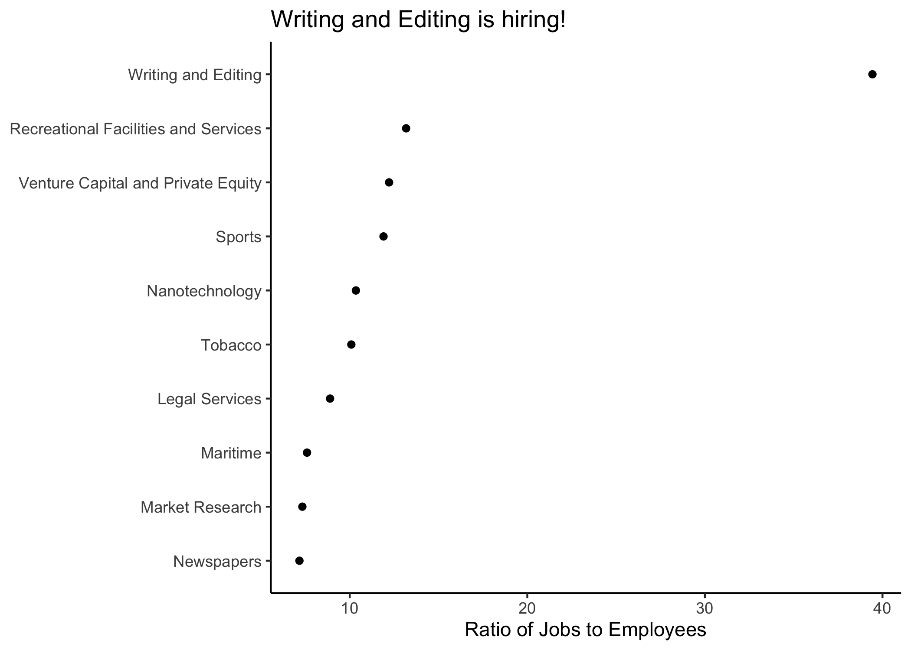
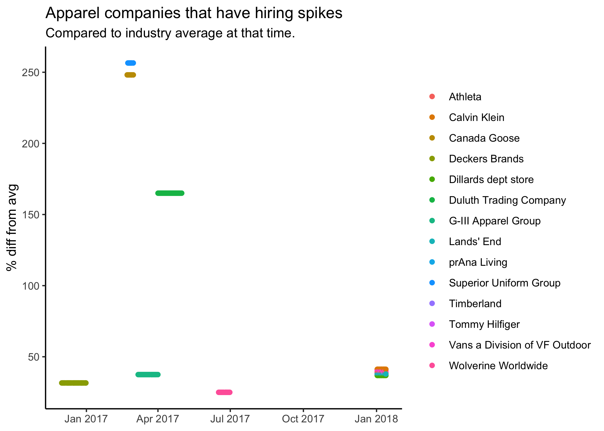

# More Effective and Efficient Recruiting

## Problem

Though 70-80% of jobs come from within a social network (Payscale.com), that still leaves 20-30% of the market opportunities being filled through general job postings on sites like LinkedIn and Indeed. That's what makes LinkedIn data so valuable for recruiters. Recruiters work to make the general job posting market more efficient, by smoothly connecting companies with quality applicants. So recruiters need to be deeply connected to market trends. Many recruiters might be connected to internal hiring schemes, but again, that still leaves 20-30% of the market on the table for upstarts or even well-connected, but data savvy recruiters.

## Opportunity

Use LinkedIn job posting information to get on top of market and industry trends in hiring. 

**Data**

  + 2 million LinkedIn job postings from 2015-2019 (courtesy of Thinknum via The Data Incubator)

**What**

  + A Rshinydashboard for understanding trends. This would allow for preliminary, exploratory analysis, that when...
  + Paired with internal information, it could become a predictive model for classifying jobs that are most likely to lead to successful applications, thereby raising the recruiter's profile and revenue.

**Answer Questions**

  + Are certain companies industry leaders while others are followers?
  + Do job postings spike afer a round of funding or are they spread out over time? (Does that tell us something about these companies?)
  
**Further Application**

  + Use Natural Language Processing to slice these questions by job types and skills. For example, is the clothing industry hiring store personnel or data scientists?
  + Connect with data from Glassdoor API to slice by salary.

## Two (Static) Examples

**1. Which industry has been growing?**

The first image displays the industries that appear to be growing immensely over the data period. It arrives at an industry average by first taking the **ratio of total company job postings to average company employees** for each company in a given industry, then averaging this figure. As the title shows, **Writing and Editing** is growing the most from 2015 to 2019. Very small start-ups (<10 employees) were excluded from this analysis.

**2. When have companies have had abnormal spikes in hiring?**

The second image displays apparel companies of greater than 150 employees that have experienced hiring spikes that were not correlated with industry hiring. The plot shows the percentage difference between **company deviation from average** and **industry deviation from average** job postings. This data is useful to spot particular moments in time when a company appears to be doing better than average. News reports would be helpful to understand **why** these changes occured at this particular point in time. This analysis could be run to see which companies have been doing poorly as well, or any number of filters. 

**Note**: The rmarkdown file in `docs` contains an interactive plotly chart. This is representative of the RShiny application I would like to build.
