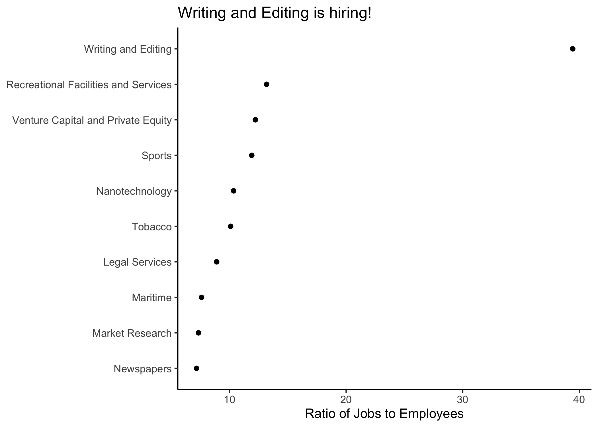
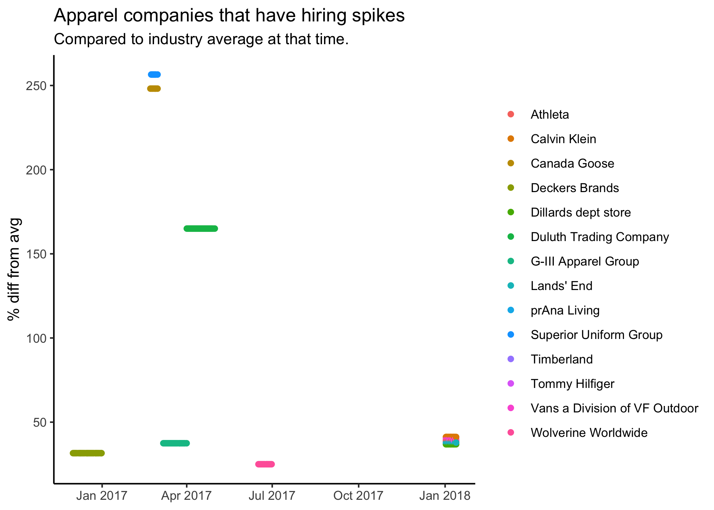

# Trends in Hiring

+ Which companies are meeting performance goals? 
+ Which ones are growing? Why? 
+ How does hiring growth influence stock price?

This project aims to answer key questions about company performance using LinkedIn job postings and stock prices.

## Key datasets

  + 2 million LinkedIn job postings from 2015-2019 (courtesy of Thinknum via The Data Incubator)
  + NYSE stock prices over the same time period at 1-day intervals (courtesy of Thinknum via of the Data Incubator)

### Which industry has been growing?

The first image displays the industries that appear to be growing immensely over the data period. It arrives at an industry average by first taking the **ratio of total company job postings to average company employees** for each company in a given industry, then averaging this figure. As the title shows, **Writing and Editing** is growing the most from 2015 to 2019. Very small start-ups (<10 employees) were excluded from this analysis. Further analysis could link this data with industry stock indices to understand trends in hiring practices.

### When have companies have had abnormal spikes in hiring?

The second image displays apparel companies of greater than 150 employees that have experienced hiring spikes that were not correlated with industry hiring. The plot shows the percentage difference between **company deviation from average** and **industry deviation from average** job postings. This data is useful to spot particular moments in time when a company appears to be doing better than average. Stock prices and news reports would be helpful to understand **why** these changes occured at this particular point in time. This analysis could be run to see which companies have been doing poorly as well, or any number of filters. It may be useful as a dynamic RShiny application for further interpretation.

The current proposal only displays LinkedIn job postings, but will be crossmatched with NYSE stock prices in the next phase.
